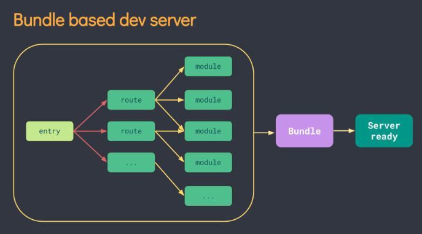
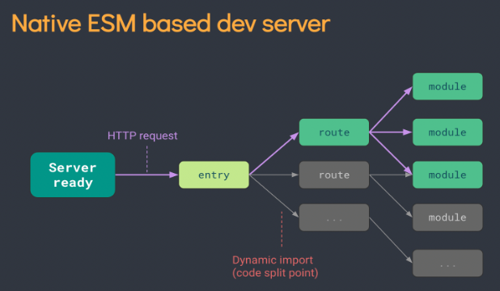
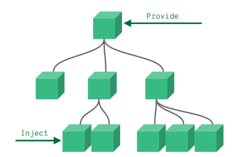

# Vue3 

[官网传送门](https://v3.cn.vuejs.org/)

## Vue3 的变化

**_性能的提升_**

- 打包大小减少 41%
- 初次渲染快 55%, 更新渲染快 133%
- 内存减少 54%

**_源码的升级_**

- 使用 Proxy 代替 defineProperty 实现响应式
- 重写虚拟 DOM 的实现和 Tree-Shaking

**_拥抱 TypeScript_**

- Vue3 可以更好的支持 TypeScript

**_新的特性_**

1. Composition API（组合 API）

- setup 配置
- ref 与 reactive
- watch 与 watchEffect
- provide 与 inject
- ......

2. 新的内置组件

- Fragment
- Teleport
- Suspense

3. 其他改变

- 新的生命周期钩子
- data 选项应始终被声明为一个函数
- 移除 keyCode 支持作为 v-on 的修饰符
- ......

## 创建 Vue3 工程

### vite 和 vue-cli 对比

|                        | vite          | vue-cli         |
| ---------------------- | ------------- | --------------- |
| 支持的 vue 版本        | 仅支持 vue3.x | 支持 2.x 和 3.x |
| 是否基于 webpack       | 否            | 是              |
| 运行速度               | 快            | 较慢            |
| 功能完整度             | 小而巧        | 大而全          |
| 是否建议企业级开发使用 | 暂不建议      | 建议            |

### 使用 vue-cli 创建

```bash
### 查看 @vue/cli 版本，确保 @vue/cli 版本在4.5.0以上
vue --version
### 安装或者升级 @vue/cli
npm install -g @vue/cli
### 创建
vue create vue_test
### 启动
cd vue_test
npm run serve
```

### 使用 vite 创建

- [vite](https://vitejs.cn)：新一代前端构建工具
- 优势：
  - 开发环境中，无需打包操作，可快速冷启动（webpack 每次运行项目都要打包）
  - 轻量快速的热重载 HMR（更改代码局部刷新，webpack 也行，但 vite 更轻量）
  - 真正的按需编译，无需等待整个应用编译完成
- 传统构建 与 vite 构建对比（vite 现用现分析，按需导入，因此项目启动更快）





```bash
npm init vite-app 项目名称

cd 项目名称
npm install
npm run dev
```

## Vue3 项目结构

Vue3 中 `main.js` 代码有所改变：

```js
// 不再引入 Vue 构造函数，而是引入 createApp 工厂函数
// createApp函数：创建 vue 的 SPA 实例
import { createApp } from 'vue'
import App from './App.vue'

// 创建应用实例对象
const app = createApp(App)
app.mount('#app')
```

Vue3 支持定义多个根节点，组件的 `<template>` 支持定义多个根节点：

```html
<template>
  <h1>根节点</h1>
  <h1>根节点</h1>
</template>
```

## 常用 Composition API

### setup

- setup 是 Vue3 中一个新的配置项，值为函数
- 组件中使用的数据、方法等都要配置在 setup 中
- setup 函数两种返回值：
  - 返回一个对象，对象中的属性、方法可在模板中直接使用
  - 返回一个渲染函数，可自定义渲染内容
- setup 函数的参数：
  - props：值为对象，包含了组件外部传进来，且组件内部声明接收的属性
  - context：上下文对象
    - `attrs`：值为对象，包含了组件外部传进来，且组件内部没有声明接收的属性，相当于 `this.$attrs`
    - `slots`：收到的插槽内容，相当于 `this.$slots`
    - `emit`：触发自定义事件的函数，相当于 `this.$emit`

```js
// 没错，渲染函数就叫 h
import { h } from 'vue'

export default {
  name: 'App',
  props: ['title'],
  // Vue3 需要声明自定义事件，虽然不声明也能运行
  emits: ['changeCount'],

  // 返回函数
  /*
  setup() {
    return () => h('h1', 'Hello')
  },
  */

  // 返回对象
  setup(props, context) {
    let name = 'Vue3'
    function sayHello() {}
    function test() {
      context.emit('changeCount', 888)
    }

    return {
      name,
      sayHello,
      test,
    }
  },
}
```

注意：

- setup 在 `beforeCreate` 钩子之前执行，`this` 为 `undefined`
- setup 不要和 Vue2 配置混用。Vue2 的配置可以访问到 setup 的属性方法，反过来不行；如有重名，setup 优先
- setup 不能是 async 函数，因为 async 函数返回的是 promise 不是对象，会导致模板无法访问属性方法
- 若要返回 promise 实例，需要 `Suspense` 和异步组件的配合

### ref 函数

作用：定义响应式数据

语法：`const name = ref(initValue)`

- `ref` 函数返回一个 `RefImpl`(reference implement) 实例对象，全称引用实现的实例对象
- 它包含响应式数据，简称引用对象、reference 对象、ref 对象
- JS 访问数据：`name.value`
- 模板访问数据：`<div>{{ name }}</div>`

注意事项：

- `ref` 函数可以接收基本数据类型和引用数据类型
- 基本类型数据的响应式还是靠 `Object.defineProperty()` 完成
- 对象类型数据使用 ES6 的 Proxy 实现响应式，Vue3 把相关操作封装在 `reactive` 函数中
- 按照之前的办法，对于对象数据，应该遍历每一层的属性添加 `getter` 、`setter`，但 Vue3 使用 Proxy 把内部数据一口气监测了

```html
<h2>{{ name }}</h2>
<p>{{ jobInfo.type }}</p>
```

```js
import { ref } from 'vue'

export default {
  setup() {
    let name = ref('Vue3')
    let jobInfo = ref({
      type: 'frontend',
      salary: '40w',
    })

    function changeInfo() {
      name.value = '鱿鱼丝'
      // jobInfo 是 RefImpl 实例
      // jobInfo.value 是 Proxy 实例对象
      jobInfo.value.salary = '50w'
    }

    return {
      name,
      jobInfo,
      changeInfo,
    }
  },
}
```

### reactive 函数

- 定义引用类型的响应式数据，不可用于 jibenleixingshuju
- `const 代理对象 = reactive(源对象)` 接收对象或数组，返回代理对象（Proxy 的实例对象）
- `reactive` 的响应式是深度的
- 基于 ES6 的 Proxy 实现，通过代理对象操作源对象内部数据

```js
import { reactive } from 'vue'

export default {
  setup() {
    let person = reactive({
      name: 'Vue3',
      sex: 'unknown',
      info: {
        school: 'Oxford',
        major: 'computer',
      },
    })

    let color = reactive(['red', 'green', 'blue'])

    function changeInfo() {
      person.info.major = 'art'
      color[0] = 'yellow'
    }

    return {
      person,
      color,
      changeInfo,
    }
  },
}
```

### ref VS reactive

定义数据：

- ref 用于定义基本类型数据
- reactive 用于定义对象或数组类型数据
- ref 也可定义对象或数组类型数据，内部通过 reactive 转为代理对象
- 一般使用 reactive 函数，可以把所有数据封装为一个对象

原理：

- ref 通过 `Object.defineProperty()` 实现响应式
- reactive 通过 Proxy 实现响应式，Reflect 操作源对象数据

使用角度：

- ref 定义数据，访问数据需要 `.value`，模板中不需要
- reactive 定义的数据，都不需要

### Vue3 响应式原理

- 通过 [Proxy](https://developer.mozilla.org/zh-CN/docs/Web/JavaScript/Reference/Global_Objects/Proxy) 代理，拦截对对象属性的操作，包括增删改查
- 通过 [Reflect](https://developer.mozilla.org/zh-CN/docs/Web/JavaScript/Reference/Global_Objects/Reflect) 反射，对源对象的属性进行操作

```js
let originPerson = {
  name: 'Lily',
  age: 22,
}

let person = new Proxy(originPerson, {
  // 拦截增加和查询操作
  get(target, prop) {
    // 读取源对象的属性
    return Reflect.get(originPerson, prop)
  },
  // 拦截修改操作
  set(target, prop, value) {
    // 修改源对象的属性
    return Reflect.set(target, prop, value)
  },
  // 拦截删除操作
  deleteProperty(target, prop) {
    // 删除源对象的属性
    return Reflect.deleteProperty(target, prop)
  },
})

console.log(person.name)
person.age = 33
person.sex = 'unknown'
delete person.age
```

### computed 函数

```js
import { reactive, computed } from 'vue'

export default {
  setup() {
    let person = reactive({
      firstName: 'Cai',
      lastName: 'QP',
    })

    // 计算属性简写形式
    person.fullName = computed(() => {
      return person.firstName + '-' + person.lastName
    })

    // 计算属性完整形式
    person.fullName = computed({
      get() {
        return person.firstName + '-' + person.lastName
      },
      set(value) {
        const arr = value.split('-')
        person.firstName = arr[0]
        person.lastName = arr[1]
      },
    })

    return {
      person,
    }
  },
}
```

### watch 函数

Vue3 `watch` 能侦听的东西：

> A watch source can only be a getter/effect function, a ref, a reactive object, or an array of these types

```js
import { ref, reactive, watch } from 'vue'
...

// 数据
let sum = ref(0)
let msg = ref('hello')
let person = reactive({
  name: 'Vue3',
  age: 18,
  info: {
    job: {
      salary: 40,
    },
  },
})
```

**_侦听 ref 定义的响应式数据：_**

- 注意不要写成 `sum.value`

```js
// 参数：侦听的数据，回调，其他配置
watch(
  sum,
  (newVal, oldVal) => {
    console.log(newVal, oldVal)
  },
  { immediate: true }
)
```

**_侦听多个 ref 定义的响应式数据：_**

```js
// newVal，oldVal 也是数组
watch([sum, msg], (newVal, oldVal) => {
  console.log(newVal, oldVal)
})
```

**_侦听 ref 定义的对象类型数据：_**

```js
// 用 ref 定义对象类型数据
let person = ref({
  name: 'Vue3',
  age: 18,
  info: {
    job: {
      salary: 40,
    },
  },
})

// 开启深度监听才有效，此时监听的是 RefImpl 实例
// Ref 实例的 value 是 Proxy 对象，存的是地址
// 因此无法监听 person 内部属性的变化
watch(person, (newVal, oldVal) => { ... }, { deep:true })

// 这个和 “侦听 reactive 函数直接返回的那一整坨响应式数据” 效果一致
watch(person.value, (newVal, oldVal) => {...})
```

**_侦听 reactive 函数直接返回的那一整坨响应式数据：_**

- oldVal 是错误的！和 newVal 的值一样
- 强制开启了深度侦听，`deep` 配置不生效！

```js
watch(
  person,
  (newVal, oldVal) => {
    console.log(newVal, oldVal)
  },
  { immediate: true, deep: false }
)
```

**_侦听 reactive 定义的响应式数据某个属性：_**

- 如果是 `() => person.info` oldVal 也是错误的！
- `() => person.name` oldVal 是正确的，何时对何时错自己琢磨吧！
- 此处没有强制开启深度监听

```js
watch(
  () => person.info,
  (newVal, oldVal) => {
    console.log(newVal, oldVal)
  },
  { deep: true }
)
```

**_侦听 reactive 定义的响应式数据多个属性：_**

```js
watch(
  [() => person.name, () => person.info],
  (newVal, oldVal) => {
    console.log(newVal, oldVal)
  },
  { deep: true }
)
```

### watchEffect 函数

- `watchEffect` 不需要指明监听哪个属性，回调里用到哪个属性，就自动监听哪个属性
- `computed` 注重计算的值，即回调函数的返回值，因此必须有返回值
- `watchEffect` 更注重过程，即回调函数的函数体，因此可没有返回值
- `watchEffect` 没有开启深度监听，也不能开启深度监听！
- `watchEffect` 内部自行修改数据，不会重新调用回调，因此不会出现递归调用

```js
// 回调中用到的数据只要发生变化，则直接重新执行回调
watchEffect(() => {
  let total = sum.value
  let p = person
  console.log('watchEffect...')
})
```

### 生命周期

注意和 `vue2.x` 的生命周期图作对比，`beforeDestroy` 和 `destroyed` 变为 `beforeUnmount` 和 `unmounted` 。


Vue3 也提供了 Composition API 形式的生命周期钩子，与 Vue2 中钩子对应关系如下：

- `beforeCreate`===>`setup()`
- `created`=======>`setup()`
- `beforeMount` ===>`onBeforeMount`
- `mounted`=======>`onMounted`
- `beforeUpdate`===>`onBeforeUpdate`
- `updated` =======>`onUpdated`
- `beforeUnmount` ==>`onBeforeUnmount`
- `unmounted` =====>`onUnmounted`

若和配置项生命钩子一起使用，则组合式会比配置项的先执行，如 `onBeforeMount` 先于 `beforeMount`

```js
import { onBeforeMount, onMounted, onBeforeUpdate, onUpdated, onBeforeUnmount, onUnmounted } from 'vue'

setup(){
  console.log('---setup---')
  let sum = ref(0)

  //通过组合式API的形式去使用生命周期钩子
  onBeforeMount(()=>{
    console.log('---onBeforeMount---')
  })
  onMounted(()=>{
    console.log('---onMounted---')
  })
  onBeforeUpdate(()=>{
    console.log('---onBeforeUpdate---')
  })
  onUpdated(()=>{
    console.log('---onUpdated---')
  })
  onBeforeUnmount(()=>{
    console.log('---onBeforeUnmount---')
  })
  onUnmounted(()=>{
    console.log('---onUnmounted---')
  })

  return {sum}
},
```

### hook 函数

- hook 是一个函数，把 setup 函数的 Composition API 进行了封装
- 类似 Vue2 的 Mixin，能复用代码，让 setup 里的逻辑更清晰
- hook 放在 hooks 文件夹中，一个文件对应一个功能模块，以 `useXxx` 命名

```js
// hooks/usePoint.js

import { reactive, onMounted, onBeforeUnmount } from 'vue'

export default function () {
  //实现鼠标“打点”相关的数据
  let point = reactive({
    x: 0,
    y: 0,
  })

  //实现鼠标“打点”相关的方法
  function savePoint(event) {
    point.x = event.pageX
    point.y = event.pageY
  }

  //实现鼠标“打点”相关的生命周期钩子
  onMounted(() => {
    window.addEventListener('click', savePoint)
  })

  onBeforeUnmount(() => {
    window.removeEventListener('click', savePoint)
  })

  return point
}
```

```js
// 使用 hook
import usePoint from '../hooks/usePoint.js'

export default {
  setup() {
    let point = usePoint()

    return { point }
  },
}
```

### toRef 函数

- 创建一个 RefImpl 实例对象，其 value 值指向另一个对象的某个属性，修改 value 值会修改源对象对应的属性
- 应用：需要把响应式对象的某个属性单独提供给外部使用
- 批量创建：`toRefs`

```js
import {reactive, toRef, toRefs} from 'vue'
...

setup() {
  let person = reactive({
    name: 'Vue3',
    age: 18,
    info: {
      job: {
        salary: 40,
      },
    },
  })

  return {
    // 注意不能写成 ref(person.name)，这和源对象是割裂开的
    name: toRef(person, 'name'),
    salary: toRef(person.info.job, 'salary')
    // or
    ...toRefs(person)
  }
}
```

## 其它 Composition API

### shallowReactive & shallowRef

- `shallowReactive`：只处理对象最外层属性的响应式，即浅响应式
- `shallowRef`：基本数据类型和 `ref` 相同，对象数据不再会调用 `reactive`，因此只有对象引用改变了才是响应式的
- 若一个对象数据，结构很深，但只有最外层属性变化，可用 `shallowReactive`
- 若一个对象数据，属性不会改变，而是使用新对象替换，可用 `shallowRef`

```js
import { shallowReactive, shallowRef } from 'vue'

setup() {
  let person = shallowReactive({
    name: 'Vue3',
    age: 21,
    info: {
      job: {
        salary: 22
      }
    }
  })
  let x = shallowRef({
    y: 0
  })
  return {
    person,
    x
  }
}
```

### readonly & shallowReadonly

- `readonly`: 让一个响应式数据变为只读的（深只读）
- `shallowReadonly`：让一个响应式数据变为只读的（浅只读）
- 应用场景: 不希望数据被修改时，如你用了别人的响应式数据，但是别人不希望你修改时

```js
setup() {
  let sum = ref(0)
  let person = reactive({...})

  sum = readonly(sum)
  person = shallowReadonly(person)

  return {
    sum,
    person
  }
}
```

### toRaw & markRaw

`toRaw`：

- 将一个由 `reactive` 生成的响应式对象转为普通对象
- 用于读取响应式对象对应的普通对象，对该普通对象的操作不会引起页面更新

`markRaw`：

- 标记一个对象，让其不成为响应式对象
- 有些值不应设置为响应式，比如复杂的第三方库
- 当渲染复杂且不变的数据时，跳过响应式转换可提高性能

注意：仅仅让数据变为非响应式的，数据变的依旧变，只是没引起页面更新

```js
setup() {
  function showRawPerson() {
    const p = toRaw(person);
    p.age++;
    console.log(p);
    console.log(person);
  }

  function addCar() {
    let car = { name: "奔驰", price: 40 };
    person.car = markRaw(car);
  }
}
```

### customRef

创建一个自定义的 ref，并对其依赖项跟踪和更新触发进行显式控制

```html
<input type="text" v-model="keyword" />
<h3>{{ keyword }}</h3>
```

```js
import { ref, customRef } from 'vue'

export default {
  name: 'Demo',
  setup() {
    // 自定义 myRef
    function myRef(value, delay) {
      let timer
      // 通过customRef去实现自定义
      return customRef((track, trigger) => {
        //
        return {
          get() {
            //告诉Vue这个value值是需要被“追踪”的
            track()
            return value
          },
          set(newValue) {
            clearTimeout(timer)
            timer = setTimeout(() => {
              value = newValue
              // 告诉Vue去更新界面
              trigger()
            }, delay)
          },
        }
      })
    }
    let keyword = myRef('hello', 500)
    return {
      keyword,
    }
  },
}
```

### provide / inject

实现祖先组件与后代组件之间通信。



```js
// 祖先组件传递数据
import { provide, reactive, ref } from 'vue'

setup() {
  let car = reactive({...})
  let sum = ref(0)

  provide('sum', sum)
  provide('car', car)
}
```

```js
// 后代组件接收数据
import { inject } from 'vue'

setup() {
  const car = inject('car')
  const sum = inject('sum')
  return { car, sum }
}
```

### 响应式数据的判断

- `isRef`: 检查一个值是否为一个 `ref` 对象
- `isReactive`: 检查一个对象是否是由 `reactive` 创建的响应式代理
- `isReadonly`: 检查一个对象是否是由 `readonly` 创建的只读代理
- `isProxy`: 检查一个对象是否是由 `reactive` 或者 `readonly` 方法创建的代理

## Compositon API 的优势

**_Options API 存在的问题_**

使用传统 Options API 中，新增或者修改一个需求，就需要分别在 data，methods，computed 等地方修改。

<div style="width:800px;overflow:hidden;">
    
    &nbsp;
    
</div>

**_Composition API 的优势_**

可以更加优雅地组织代码、函数，让相关功能的代码更加有序的组织在一起。说白了就是让同一个功能的代码整合到一起，日后修改代码直接找对应的功能模块。

<div style="width:800px;height:340px;overflow:hidden;">
    
    &nbsp;
    
</div>

## 新的组件

### Fragment

- 在 Vue2 中: 组件必须有一个根标签
- 在 Vue3 中: 组件可以没有根标签, 内部会将多个标签包含在一个 `Fragment` 虚拟元素中
- 好处: 减少标签层级, 减小内存占用

### Teleport

- 将包裹的 HTML 结构移动到指定元素的末尾
- `to` 属性为 CSS 选择器

简易的模态框效果：

```html
<teleport to="#root">
  <div v-if="isShow" class="mask">
    <div class="dialog">
      <h3>我是一个弹窗</h3>
      <button @click="isShow = false">关闭弹窗</button>
    </div>
  </div>
</teleport>
```

```css
.mask {
  /* 遮罩层铺满窗口 */
  position: absolute;
  top: 0;
  bottom: 0;
  left: 0;
  right: 0;
  background-color: rgba(0, 0, 0, 0.5);
}
.dialog {
  position: absolute;
  top: 50%;
  left: 50%;
  transform: translate(-50%, -50%);
  text-align: center;
  width: 300px;
  height: 300px;
  background-color: green;
}
```

### Suspense

等待异步组件时渲染额外内容，让用户体验更好

异步引入组件：

```js
import { defineAsyncComponent } from 'vue'
const Child = defineAsyncComponent(() => import('./components/Child.vue'))
```

使用 `Suspense` 包裹组件，实际上是往插槽填充内容，`default` 插槽填充组件内容，`fallback` 插槽填充组件加载时显示的内容：

```html
<Suspense>
  <template v-slot:default>
    <Child />
  </template>
  <template v-slot:fallback>
    <h3>加载中，请稍等...</h3>
  </template>
</Suspense>
```

另外，若 `Child` 组件的 `setup` 函数返回一个 Promise 对象，也能渲染 `fallback` 里的内容：

```js
async setup() {
  let sum = ref(0)
  return await new Promise((resolve, reject) => {
    setTimeout(() => {
      resolve({sum})
    }, 3000)
  })
}
```

## 其他改变

- 全局 API 的转移

Vue3 将全局的 API，即：`Vue.xxx` 调整到应用实例 `app` 上：

| Vue2 全局 API            | Vue3 实例 API               |
| ------------------------ | --------------------------- |
| Vue.config.xxx           | app.config.xxx              |
| Vue.config.productionTip | 移除                        |
| Vue.component            | app.component               |
| Vue.directive            | app.directive               |
| Vue.mixin                | app.mixin                   |
| Vue.use                  | app.use                     |
| Vue.prototype            | app.config.globalProperties |

- `data` 选项应始终被声明为一个函数

- 过渡类名的更改：

```css
/* Vue2 */
.v-enter,
.v-leave-to {
  opacity: 0;
}
.v-leave,
.v-enter-to {
  opacity: 1;
}

/* Vue3 */
.v-enter-from,
.v-leave-to {
  opacity: 0;
}

.v-leave-from,
.v-enter-to {
  opacity: 1;
}
```

- 移除 `keyCode` 作为 `v-on` 的修饰符，同时也不再支持 `config.keyCodes`
- 移除 `v-on.native`修饰符，子组件没有在 `emits: ['close']` 声明的自定义事件作为原生事件处理
- 移除过滤器 `filter`
- ...

---

---

## 组件上的 v-model

当需要维护组件内外数据的同步时，可以在组件上使用 `v-model` 指令。

父组件传值：

```html
<!-- 父组件传值 -->
<my-counter v-model:number="count"></my-counter>
```

子组件在 `emits` 节点声明自定义事件，格式为 `update:xxx` ，调用 `$emit` 触发自定义事件：

```js
export default {
  props: ['number'],
  emits: ['update:number'],
  methods: {
    add() {
      this.$emit('update:number', this.number++)
    },
  },
}
```

注意，在 `vue3` 中 `props` 属性同样是只读的，上面 `this.number++` 并没有修改 `number` 的值。

其实通过 `v-bind` 传值和监听自定义事件的方式能实现和 `v-model` 相同的效果。

## EventBus

借助于第三方的包 `mitt` 来创建 `eventBus` 对象，从而实现兄弟组件之间的数据共享。

安装 `mitt` 依赖包：

```bash
npm install mitt@2.1.0
```

创建公共的 `eventBus` 模块：

```js
import mitt from 'mitt'

// 创建 EventBus 实例对象
const bus = mitt()

export default bus
```

数据接收方调用 `bus.on()` 监听自定义事件：

```js
import bus from './eventBus.js'

export default {
  data() {
    return { count: 0 }
  },
  created() {
    bus.on('countChange', (count) => {
      this.count = count
    })
  },
}
```

数据接发送方调用 `bus.emit()` 触发事件：

```js
import bus from './eventBus.js'

export default {
  data() {
    return { cout: 0 }
  },
  methods: {
    addCount() {
      this.count++
      bus.emit('countChange', this.count)
    },
  },
}
```

## vue 3.x 全局配置 axios

实际项目开发中，几乎每个组件中都会使用 `axios` 发起数据请求。此时会遇到如下两个问题：

- 每个组件中都需要导入 `axios`（代码臃肿）
- 每次发请求都需要填写完整的请求路径（不利于后期的维护）

在 `main.js` 文件中进行配置：

```js
// 配置请求根路径
axios.defaults.baseURL = 'http://api.com'

// 将 axios 挂载为 app 全局自定义属性
// 每个组件可通过 this.$http 访问到 axios
app.config.globalProperties.$http = axios
```

组件调用：

```js
this.$http.get('/users')
```
